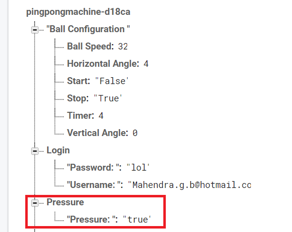
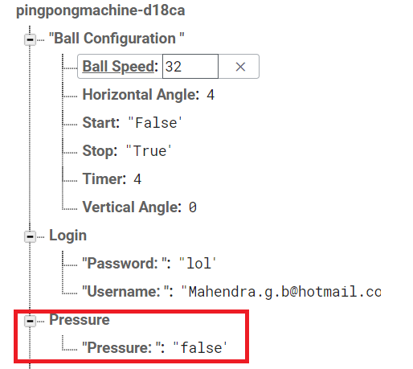

# Force Sensor Build Instructions

#### Table of Contents

1.[Introduction](https://github.com/Abshir-Mohamud/BallSensor#introduction)

2.[Bill of Materials](https://github.com/Abshir-Mohamud/BallSensor#bill-of-materials)

3.[Time Commitments](https://github.com/Abshir-Mohamud/BallSensor#time-commitments)

4.[Mechanical Assembly](https://github.com/Abshir-Mohamud/BallSensor#mechanical-assembly)

5.[PCB and Soldering](https://github.com/Abshir-Mohamud/BallSensor#pcb-and-soldering)

6.[Power Up](https://github.com/Abshir-Mohamud/BallSensor#power-up)

7.[Unit Testing](https://github.com/Abshir-Mohamud/BallSensor#unit-testing)

8.[Production Testing](https://github.com/Abshir-Mohamud/BallSensor#production-testing)

9.[Reproducible?](https://github.com/Abshir-Mohamud/BallSensor#reproducible?)

## Introduction
My name is Abshir Mohamud and the author for this FSR01CE-ND Force Sensing Resistor build instruction manual. The force sensor circuit shown within this document will later be used to create a Smart Ping Pong ball machine within the span of the 6th semester. Within this manual the cost, time commitment, circuit, PCB and soldering needed for the creation of the circuit will be shown and explained. System diagram of circuit shown below: 

## Bill of Materials 
Below is a list of parts required for the creation of the force sensor circuit. The total price for all parts comes to 65.72 without shipping. Shipping is not included within this calculation because all parts are ordered on Amazon and with Amazon Prime shipping of parts would be free. This cost is the minimum required amount needed to create the circuit with no spares. Male and female header sockets are bought in packages for solder practice and together with the extra standoff screws will be used for cumulative project. (PCB and Acrylic Case are free due to in school facilities).

## Time Commitment 
Attached below is an image of the Gantt chart which schedules the build process during the entirety of the semester of the project. Each step of the process is handed in at the end of each week. If the project itself was built within the shortest amount of time while ignoring the weekly schedule the chart underneath the image would better illustrate the sense of time needed to complete the project

*  *Based on school timing, also dependent on circuit board printing backlog
*  **Printed on the following day assuming that school system is used

## Mechanical Assembly
A breadboarding diagram of the force sensor circuit created using the Fritzing program is shown below. The sensor being the only load in the circuit is attached to the microcontroller with a resistor to reduce the current. The circuit itself is simple due to the fact that most of the work is done through the software uploaded onto the NodeMCU.

## PCB and Soldering
PCB designed using Fritzing is shown below.

Completely Soldered PCB with parts attached to header pins shown below.

## Power Up
Code is run on Arduino IDE with outputs shown on both the Arduino’s Serial Monitor and Firebase Realtime Database. The serial monitor only displays an output when pressure is applied to the sensor while the database’s “Pressure” branch will stay false unless pressure is applied when it will then turn true. Images of both the serial monitor output and both states of the database are shown below. Link to code is also attached for testing here ([Code](Documents/Force_Sensor_ino))

## Unit Testing
Software component can be broken down into two distinct parts for unit testing the functionality of the pressure sensor and the ability to connect to the database and store data within it. Code given above will only work if an internet connection is established will then test the sensor for data. For the purpose of unit testing I’ve created a new file that will only test for the pressure applied to the sensor and give it a numerical value. An image of attached as well. Link to code is also attached for testing here ([Code](Documents/PressureSensorValues_AbshirMohamud.ino))

## Production Testing

## Reproducible?
Using the PCB design and code provided in the build instruction the reproducibility of the force sensor cirucit is possible 
