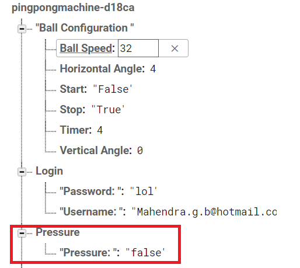
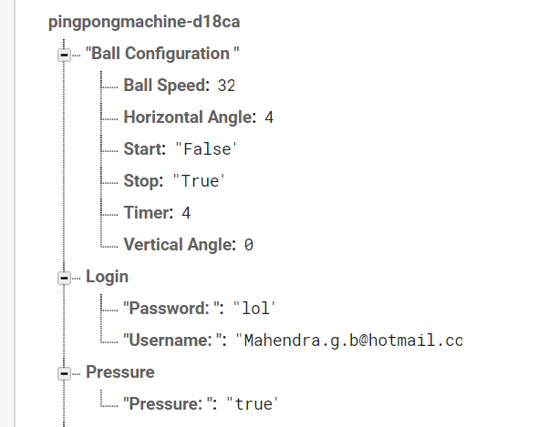
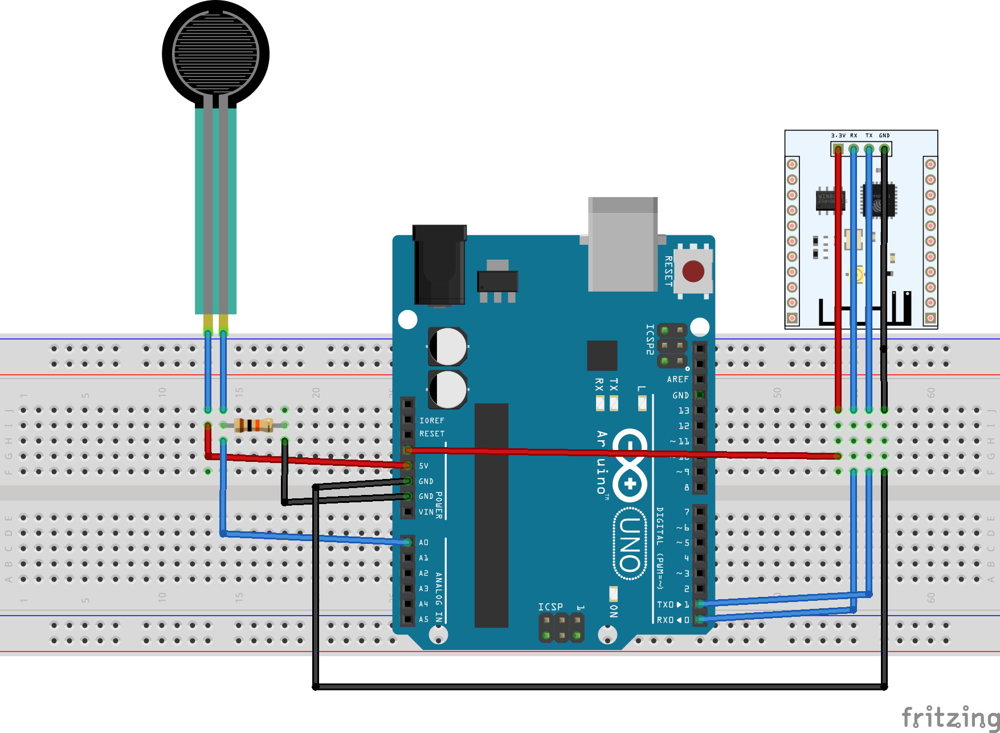
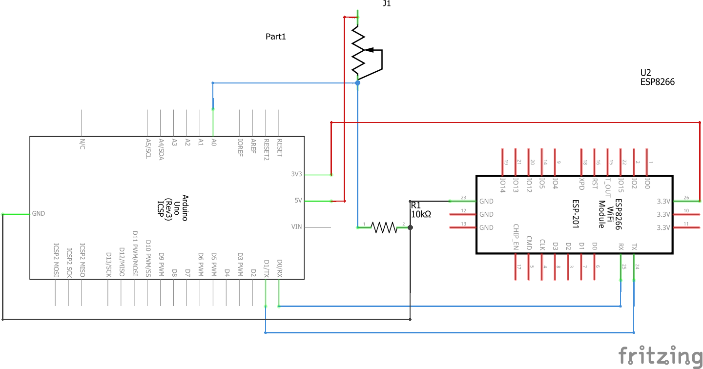
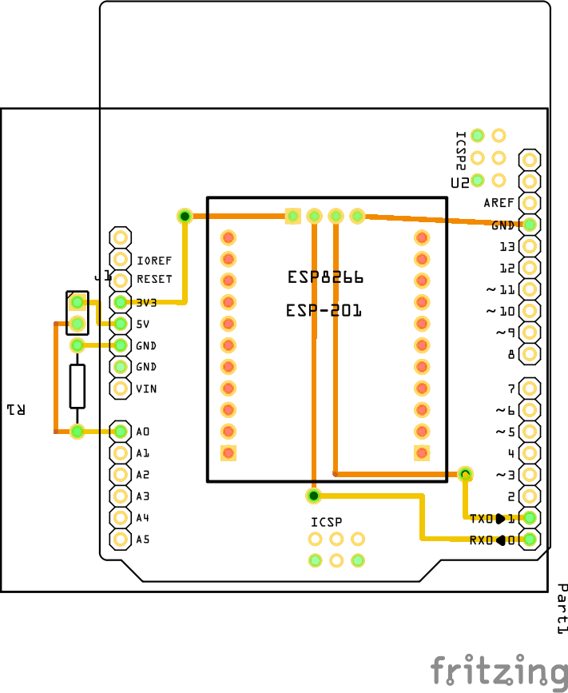
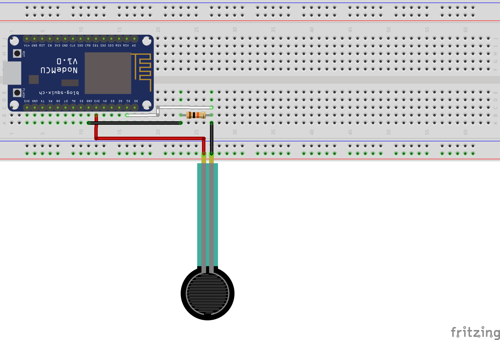
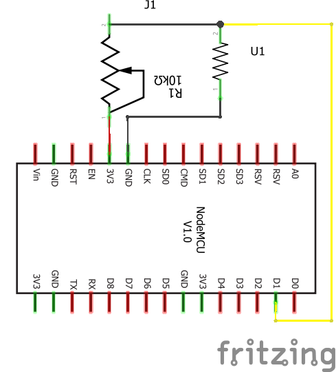
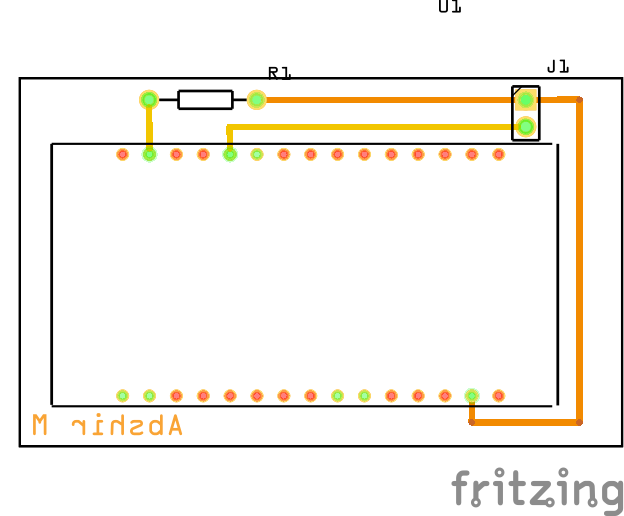

### October 31th, 2019 (Week 8)
Breadboarding of circuit is completed and shown in class. Circuit is connected to Firebase realtime database which updates a pressure branch within my groups database. The current database just allows us to see if pressure is applied or not but later implementations will use the pressure sensor to see if balls are loaded to be fired and if no more balls are loaded after a certain amount of time to update the users app to display statistics and to end regiment.

### October 17th, 2019 (Week 7)
Breadboard, Schematic, and PCB design are done for purchased sensor. 
[BreadBoard design]

[Schematic design]

[PCB design]

[Fritzing File](https://github.com/Abshir-Mohamud/BallSensor/blob/master/Documents/PressureSensorPCB_AbshirMohamud.fzz)

Edit: Arduino Uno when using a WiFi module cannot connect to FireBase. Now using a NodeMCU
[BreadBoard design]

[Schematic design]

[PCB design]

[Fritzing File](https://github.com/Abshir-Mohamud/BallSensor/blob/master/Documents/AbshirMohamud_PressureSensorV1.fzz)

### October 10th, 2019 (Week 6)
Acquisitions are shown in class.
Edit: A NodeMCU was aquired during the Reading Week due to the Arduino Unos inability to connect to Firebase.

### October 3rd, 2019 (Week 5)
Parts within budget are purchased on respective websites and all receipts are put into a single document.
[Proof Of Purchase](https://github.com/Abshir-Mohamud/BallSensor/blob/master/Documents/ProofOfPurchaseAbshirMohamud.pdf)

### September 26th, 2019 (Week 4)
Today, I have met with our collaborator for the project and have finalized the parts that will be used in the project. The following list contains those parts and include their pricing.
[Project Budget](https://github.com/Abshir-Mohamud/BallSensor/blob/master/Documents/BudgetAbshirMohamud.pdf)

### September 19th, 2019 (Week 3)
Estimate Project Schedule for the Ping Pong machine project has been uploaded to the github page.
[Project Sechdule](https://github.com/Abshir-Mohamud/BallSensor/blob/master/Documents/ProjectScheduleAbshirMohamud.pdf)

### September 12th, 2019 (Week 2)
Proposal and Content for the Ping Pong machine project were both uploaded to github page.
[Project Proposal](https://github.com/Abshir-Mohamud/BallSensor/blob/master/Documents/ProjecttProposalAbshirMohamud.pdf)

### September 5th, 2019 (Week 1)
Repository is created. Sensor is picked (FSR01CE Force Sensor Resistor).

